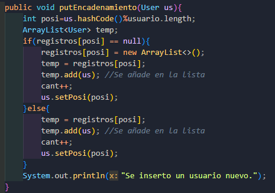
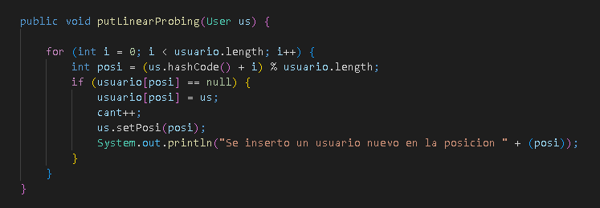
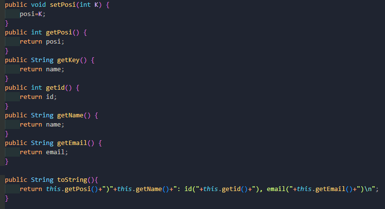
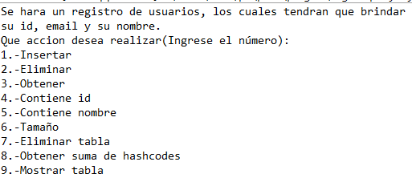

# EDA_Repositorio_Grupal_7

<html>
   <head>
      <meta content="text/html; charset=UTF-8" http-equiv="content-type">
   </head>
   <body class="c31 doc-content">
      

         

         
         <table class="c42">
            <tr class="c52">
               <td class="c6" colspan="1" rowspan="1">
                  

               </td>
               <td class="c21" colspan="1" rowspan="1">
                  
UNIVERSIDAD NACIONAL DE SAN AGUSTIN

                  
FACULTAD DE INGENIER&Iacute;A DE PRODUCCI&Oacute;N Y SERVICIOS

                  
ESCUELA PROFESIONAL DE INGENIER&Iacute;A DE SISTEMA

               </td>
               <td class="c46" colspan="1" rowspan="1">
                  

               </td>
            </tr>
            <tr class="c40">
               <td class="c47" colspan="3" rowspan="1">
                  
Formato: Gu&iacute;a de Pr&aacute;ctica de Laboratorio / Talleres / Centros de Simulaci&oacute;n

               </td>
            </tr>
            <tr class="c43">
               <td class="c6" colspan="1" rowspan="1">
                  
Aprobaci&oacute;n: &nbsp;2022/03/01

               </td>
               <td class="c21" colspan="1" rowspan="1">
                  
C&oacute;digo: GUIA-PRLE-001

               </td>
               <td class="c46" colspan="1" rowspan="1">
                  
P&aacute;gina: 

               </td>
            </tr>
         </table>
         

      

      
INFORME DE LABORATORIO

      
(formato estudiante)

      
      <table class="c42">
         <tr class="c29">
            <td class="c4" colspan="6" rowspan="1">
               
INFORMACI&Oacute;N B&Aacute;SICA

            </td>
         </tr>
         <tr class="c17">
            <td class="c30" colspan="1" rowspan="1">
               
ASIGNATURA: 

            </td>
            <td class="c3" colspan="5" rowspan="1">
               
Laboratorio - Estructura de datos y algoritmos

            </td>
         </tr>
         <tr class="c17">
            <td class="c30" colspan="1" rowspan="1">
               
T&Iacute;TULO DE LA PR&Aacute;CTICA: 

            </td>
            <td class="c3" colspan="5" rowspan="1">
               
Hash

            </td>
         </tr>
         <tr class="c17">
            <td class="c30" colspan="1" rowspan="1">
               
N&Uacute;MERO DE PR&Aacute;CTICA:

            </td>
            <td class="c32" colspan="1" rowspan="1">
               
07

            </td>
            <td class="c11" colspan="1" rowspan="1">
               
A&Ntilde;O LECTIVO:

            </td>
            <td class="c13" colspan="1" rowspan="1">
               
2022 - A

            </td>
            <td class="c13" colspan="1" rowspan="1">
               
NRO. SEMESTRE:

            </td>
            <td class="c33" colspan="1" rowspan="1">
               
III

            </td>
         </tr>
         <tr class="c17">
            <td class="c30" colspan="1" rowspan="1">
               
FECHA DE PRESENTACI&Oacute;N

            </td>
            <td class="c32" colspan="1" rowspan="1">
               
14/08/2022

            </td>
            <td class="c11" colspan="1" rowspan="1">
               
HORA DE PRESENTACI&Oacute;N

            </td>
            <td class="c54" colspan="3" rowspan="1">
               

            </td>
         </tr>
         <tr class="c17">
            <td class="c39" colspan="4" rowspan="1">
               
INTEGRANTE (s): 

               <ul class="c5 lst-kix_list_3-0 start">
                  <li class="c8 c12 li-bullet-0">Garay Bedregal C&eacute;sar Alejandro - cgarayb@unsa.edu.pe</li>
                  <li class="c8 c12 li-bullet-0">Chua Aguilar Jean Carlo Leonel - jchua@unsa.edu.pe</li>
                  <li class="c8 c12 li-bullet-0">Cahuana Aguilar Josu&eacute; Math&iacute;as Miguel - jcahuanaag@unsa.edu.pe</li>
                  <li class="c8 c12 li-bullet-0">Huisa Perez Willy Alexander - whuisa@unsa.edu.pe</li>
                  <li class="c8 c12 li-bullet-0">Arocutipa Gutierres Luis Edgar - larocutipa@unsa.edu.pe</li>
               </ul>
               

            </td>
            <td class="c13" colspan="1" rowspan="1">
               
NOTA:

            </td>
            <td class="c33" colspan="1" rowspan="1">
               

            </td>
         </tr>
         <tr class="c17">
            <td class="c18" colspan="6" rowspan="1">
               
DOCENTE(s):

               
Richart Smith Escobedo Quispe - rescobedoq@unsa.edu.pe

               

            </td>
         </tr>
      </table>
      

      
      <table class="c42">
         <tr class="c29">
            <td class="c4" colspan="1" rowspan="1">
               
SOLUCI&Oacute;N Y RESULTADOS

            </td>
         </tr>
         <tr class="c57">
            <td class="c36" colspan="1" rowspan="1">
               <ol class="c5 lst-kix_list_1-0 start" start="1">
                  <li class="c23 li-bullet-1">SOLUCI&Oacute;N DE EJERCICIOS/PROBLEMAS</li>
               </ol>
               
&nbsp; &nbsp; &nbsp; Ejercicio 1

               <ul class="c5 lst-kix_km2f0u6ff71u-0 start">
                  <li class="c26 c12 li-bullet-0">En el primer ejercicio se completaron los m&eacute;todos designados en la interfaz hashtable, adem&aacute;s de hacer un men&uacute;, en el cual se pueda elegir entre todos los m&eacute;todos ya definidos con anterioridad.</li>
               </ul>
               
Los m&eacute;todos de la clase HashTable fueron put(), remove(), size(), isEmpty(), get(), clear(), toString(), hashCode(), containsKey() y containsValue().

               
&nbsp; &nbsp; &nbsp; &nbsp;Ejercicio 2

               <ul class="c5 lst-kix_km2f0u6ff71u-0">
                  <li class="c8 c12 li-bullet-0">Encadenamiento : El siguiente &nbsp;m&eacute;todo se encarga de hacer la inserci&oacute;n considerando la colisi&oacute;n que pudiera haber en la tabla de hashing, en caso sucediera, se a&ntilde;ade en la posici&oacute;n que ya est&aacute; ocupada haciendo uso de un ArrayList para que de esta manera sea mucho m&aacute;s din&aacute;mico y evitemos el problema de posiciones ya tomadas. Se usp un arreglo (10 posiciones) de ArrayList que conforme los elementos ingresaban estos se iban colocando en la posici&oacute;n correspondiente</li>
               </ul>
               

               

               

               <ul class="c5 lst-kix_km2f0u6ff71u-0">
                  <li class="c8 c12 li-bullet-0">Linear Probing: El siguiente m&eacute;todo se encarga de hacer la inserci&oacute;n considerando la colisi&oacute;n posible en la tabla de hashing, ya que en caso sucediera se traslada a la siguiente posici&oacute;n disponible hasta que se encuentre un espacio libre, en el peor de los casos da un giro completo.</li>
               </ul>
               

               

               

               

               

               
Ejercicio 3

               

               

               
Se agregaron otros m&eacute;todos que nos ayudaron a nuestra soluci&oacute;n, estos son getter y setters de los atributos de User, tambi&eacute;n se agreg&oacute; un toString extra para poder visualizar mejor la informaci&oacute;n a la hora de mostrar el hash cuando se insert&oacute; y se manejaron las colisiones por encadenamiento

               

               

               

               

               

               

               

               
Ejercicio 4

               
Crear un archivo de test donde incluyan casos de prueba.

               
En el archivo HashDemo&nbsp;se cre&oacute; un programa el cual servir&aacute; para almacenar la informaci&oacute;n de personas. La informaci&oacute;n se guardar&aacute; en los objetos User, los cuales obtendr&aacute;n el id, el nombre y el email de la persona, luego el User&nbsp;ser&aacute; agregado al HashTable. Adicionalmente se agregaron diferentes opciones que se puede realizar. Primero esta la opcion de &ldquo;Insertar&rdquo;, esto nos permitir&aacute; agregar un nuevo User al HastTable, la opci&oacute;n &ldquo;Eliminar&rdquo; permite eliminar un user de la HashTable usando el nombre, la opci&oacute;n &ldquo;Obtener&rdquo; permite buscar un User con el nombre y devolver&aacute; los datos si se encuentra, la opci&oacute;n &ldquo;Contiene id&rdquo; permite buscar un User con un id; solo dir&aacute; si hay una coincidencia, pero no devolver&aacute; datos; la opci&oacute;n &ldquo;Contiene nombre&rdquo; permite buscar un User con un nombre; solo dir&aacute; si hay una coincidencia, pero no devolver&aacute; datos; &nbsp;la opci&oacute;n &ldquo;Tama&ntilde;o&rdquo; devuelve el n&uacute;mero de personas registradas en el HashTable, la opci&oacute;n &ldquo;Eliminar tabla&rdquo; elimina todos los usuarios registrados de la HashTable, la opci&oacute;n &ldquo;Obtener suma de hashcodes&rdquo; devuelve la suma de los hashcodes&nbsp;de todos los usuarios registrados, la opci&oacute;n &ldquo;Mostrar tabla&rdquo; muestra todos los usuarios registrados con sus datos.

               

               

               

               

            </td>
         </tr>
         <tr class="c19">
            <td class="c36" colspan="1" rowspan="1">
               <ol class="c5 lst-kix_list_1-0" start="2">
                  <li class="c26 c41 li-bullet-2">SOLUCI&Oacute;N DEL CUESTIONARIO</li>
               </ol>
               <ul class="c5 lst-kix_list_11-0 start">
                  <li class="c8 c51 li-bullet-0">No hay cuestionario</li>
               </ul>
               

            </td>
         </tr>
         <tr class="c19">
            <td class="c36" colspan="1" rowspan="1">
               <ol class="c5 lst-kix_list_1-0" start="3">
                  <li class="c23 li-bullet-2">CONCLUSIONES</li>
               </ol>
               <ul class="c5 lst-kix_list_12-0 start">
                  <li class="c8 c12 li-bullet-0">La implementaci&oacute;n del Hash mostr&oacute; su efectividad a la hora de buscar elementos, as&iacute; como realizar otro tipo de operaciones.</li>
                  <li class="c8 c12 li-bullet-0">La implementaci&oacute;n nos ayud&oacute; a entender m&aacute;s acerca del comportamiento del Hash</li>
                  <li class="c8 c12 li-bullet-0">Se pudo elaborar un sistema de registros haciendo uso de Hash</li>
               </ul>
            </td>
         </tr>
      </table>
      

      
      <table class="c42">
         <tr class="c29">
            <td class="c4" colspan="1" rowspan="1">
               
RETROALIMENTACI&Oacute;N GENERAL

            </td>
         </tr>
         <tr class="c19">
            <td class="c36" colspan="1" rowspan="1">
               

               

            </td>
         </tr>
      </table>
      

      
      <table class="c42">
         <tr class="c29">
            <td class="c4" colspan="1" rowspan="1">
               
REFERENCIAS Y BIBLIOGRAF&Iacute;A

            </td>
         </tr>
         <tr class="c38">
            <td class="c36" colspan="1" rowspan="1">
               

            </td>
         </tr>
      </table>
      

      

   </body>
</html>